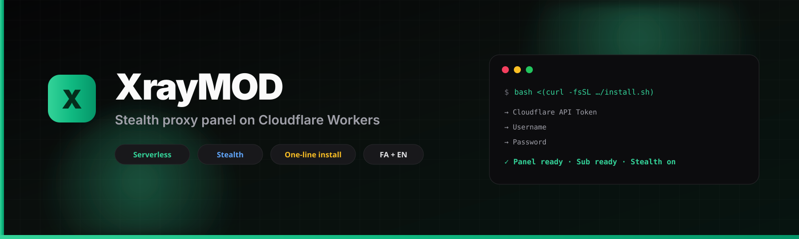

<p align="center">
  
</p>

<p align="center">
  <b>پنل مخفی و مدرن مدیریت پروکسی روی Cloudflare Workers</b><br/>
  اوپن‌سورس · سرورلس · صفحه وضعیت کاربر · ساب هوشمند · فارسی
</p>

<p align="center">
  <a href="LICENSE"></a>
  <a href="https://github.com/askarniroomand/XRayMOD/stargazers"></a>
  <a href="https://t.me/MRROBOT_DT"></a>
  <a href="README.md"></a>
  <a href="https://github.com/askarniroomand"></a>
</p>

---

## XrayMOD چیه؟

پنل **self-hosted** برای ساخت و مدیریت کانفیگ روی **Cloudflare Workers + D1**:

| | |
|:--|:--|
| 🥷 | پنل پشت **UUID مخفی** — بقیه صفحه جعلی می‌بینند |
| ☁️ | بدون VPS اجباری |
| 📊 | صفحه وضعیت کاربر: حجم، روز، QR |
| 🎯 | ساب هوشمند تا **۱۰ کانفیگ** پیشنهادی |
| 🇮🇷 | UI فارسی + انگلیسی |
| ⚡ | نصب با **یک دستور** |

---

## ⚡ یک دستور · کاملاً خودکار

### 🪟 ویندوز — داخل PowerShell (`PS C:\...`)

```powershell
irm https://raw.githubusercontent.com/askarniroomand/XRayMOD/main/install.ps1 | iex
```

### 🪟 ویندوز — داخل CMD (`C:\...` بدون `PS`)

```cmd
powershell -NoProfile -ExecutionPolicy Bypass -Command "iex (iwr -UseBasicParsing 'https://raw.githubusercontent.com/askarniroomand/XRayMOD/main/install.ps1').Content"
```

### 🐧 لینوکس / 🍎 مک / WSL

```bash
bash <(curl -fsSL https://raw.githubusercontent.com/askarniroomand/XRayMOD/main/install.sh)
```

اسکریپت **خودش** ابزارها (Node، Python/uv) را نصب می‌کند، سورس را از GitHub می‌گیرد و پنل را می‌سازد.  
**git لازم نیست.** توکن فقط داخل ترمینال وارد می‌شود و **به ریپو نمی‌رود**. فقط ۳ ورودی از تو:

| مرحله | ورودی |
|:-----:|:------|
| ۱ | 🔑 توکن Cloudflare |
| ۲ | 👤 نام کاربری |
| ۳ | 🔒 رمز عبور |

بقیه خودکار: D1 · UI · Worker · کانفیگ · لینک‌ها

### توکن

[ساخت API Token](https://dash.cloudflare.com/profile/api-tokens) → قالب **Edit Cloudflare Workers**

---

## ✨ قابلیت‌های تازه (نسل ۵.۱.۱)

- **SECURE PATH اجباری** — بدون UUID تصادفی، همه مسیرها ۴۰۴  
- **Admin Dashboard** — آپدیت، ریست پسورد، دامنه سفارشی، ایمیل CF، kill switch  
- **صفحه وضعیت** `/{SECURE}/me/<uuid>`  
- **ساب Top-10 + تگ D** برای دامنه سفارشی  
- **استیلث پیش‌فرض** — fallback خاموش ۴۰۴  
- **Canary** — طعمه اسکنر + لاگ  
- **Backup / Remote sync / Audit**  

---

## لینک‌های مهم

| لینک | کاربرد |
|:-----|:-------|
| `/<SECURE_PATH>/login` | ورود ادمین (خصوصی) |
| `/<SECURE_PATH>/panel` | داشبورد |
| `/<SECURE_PATH>/sub/<UUID_کاربر>` | ساب اپ‌ها |
| `/<SECURE_PATH>/me/<UUID_کاربر>` | صفحه وضعیت کاربر |

> ⚠️ مسیرهای قدیمی مثل `/panel` یا `/sub/...` بدون SECURE PATH دیگر کار نمی‌کنند (۴۰۴).

کلاینت: v2rayNG ≥ ۲.۲.۳ (Hev TUN) · sing-box ≥ ۱.۱۲ · Streisand · Hiddify

---

## 🛠 نصب دستی

<details>
<summary><b>گام‌به‌گام</b></summary>

<br/>

```bash
git clone https://github.com/askarniroomand/XRayMOD.git
cd XRayMOD
npm install
npm install --prefix frontend
npm run build:ui
npx wrangler login
npx wrangler d1 create xraymod-db
# database_id را در wrangler.toml بگذار
npx wrangler deploy
```

راه‌اندازی:

```bash
curl -X POST "https://WORKER.workers.dev/install" \
  -H "Content-Type: application/json" \
  -d '{"username":"admin","password":"YourStrongPass123"}'
```

ورود:

```text
https://WORKER.workers.dev/<ACCESS_UUID>/login
```

ساب و وضعیت:

```text
https://WORKER.workers.dev/sub/<USER_UUID>
https://WORKER.workers.dev/me/<USER_UUID>
```

</details>

---

## پشتیبانی و کانال

<p align="center">
  <a href="https://t.me/MRROBOT_DT"></a>
</p>

سوال، باگ، پیشنهاد — خوشحال می‌شیم کمک کنیم 💚  

**لطفاً لینک پنل، رمز و توکن را عمومی نفرست.**

نسخه انگلیسی: [README.md](README.md)

---

## لایسنس

[MIT](LICENSE)
