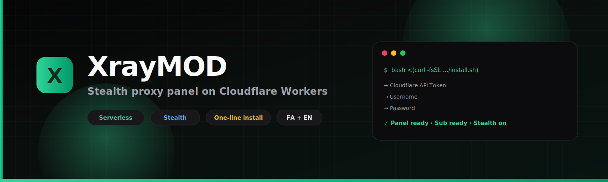
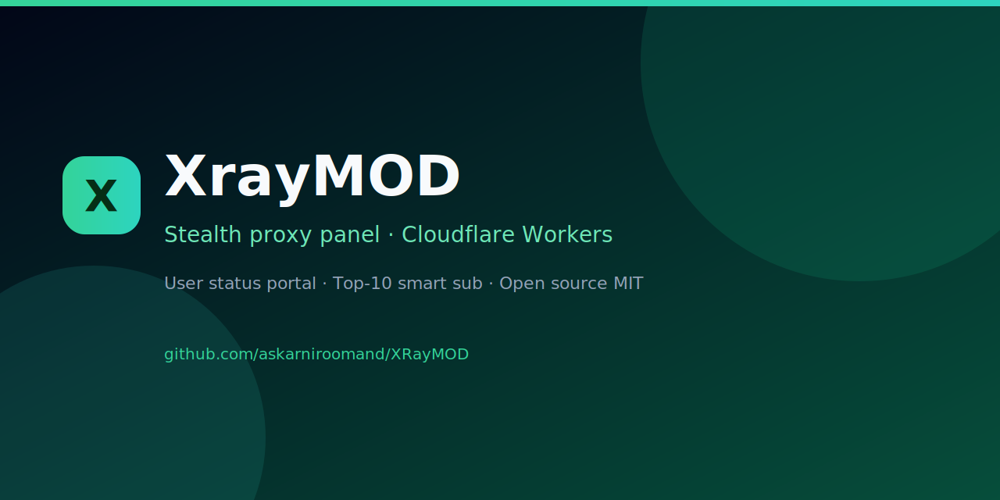

<p align="center">
  
</p>

<p align="center">
  <strong>⚡ Open-source · Serverless · Stealth-first</strong><br/>
  Modern <b>VLESS / Trojan / VMess</b> panel on <b>Cloudflare Workers + D1</b><br/>
  <sub>User status portal · Top-10 smart sub · Clean IP · Persian UI · One-line install</sub>
</p>

<p align="center">
  <a href="LICENSE"></a>
  <a href="https://workers.cloudflare.com"></a>
  <a href="https://www.typescriptlang.org"></a>
  <a href="https://nextjs.org"></a>
  <a href="https://github.com/askarniroomand/XRayMOD/stargazers"></a>
  <a href="https://github.com/askarniroomand/XRayMOD/network/members"></a>
  <a href="https://t.me/MRROBOT_DT"></a>
</p>

<p align="center">
  <a href="#-فارسی"><b>🇮🇷 فارسی</b></a>
  ·
  <a href="#-english"><b>🇬🇧 English</b></a>
  ·
  <a href="#-quick-start"><b>⚡ Install</b></a>
  ·
  <a href="#-features"><b>✨ Features</b></a>
  ·
  <a href="https://t.me/MRROBOT_DT"><b>💬 Community</b></a>
  ·
  <a href="https://github.com/askarniroomand"><b>👤 Author</b></a>
</p>

---

<a id="-quick-start"></a>

<br/>

<div align="center">

### ⚡ یک دستور · نصب کاملاً خودکار

**🪟 Windows — داخل PowerShell (`PS C:\...`):**

```powershell
irm 'https://cdn.jsdelivr.net/gh/askarniroomand/XRayMOD@main/install.ps1' | iex
```

**🪟 Windows — داخل CMD:**

```cmd
powershell -NoProfile -ExecutionPolicy Bypass -Command "irm 'https://cdn.jsdelivr.net/gh/askarniroomand/XRayMOD@main/install.ps1' | iex"
```

**🐧 Linux / 🍎 macOS / WSL:**

```bash
bash <(curl -fsSL https://cdn.jsdelivr.net/gh/askarniroomand/XRayMOD@main/install.sh)
```

اسکریپت **خودش** Node و Python/uv را (در صورت نبود) نصب می‌کند، سورس را از GitHub می‌گیرد و دیپلوی می‌کند.  
تو فقط وارد می‌کنی: **توکن Cloudflare** · **یوزر** · **رمز**.

<table>
<tr>
<td align="center"><b>🔑 Token</b><br/><sub>Cloudflare API</sub></td>
<td align="center">→</td>
<td align="center"><b>👤 Username</b><br/><sub>Panel admin</sub></td>
<td align="center">→</td>
<td align="center"><b>🔒 Password</b><br/><sub>Your choice</sub></td>
<td align="center">→</td>
<td align="center"><b>✨ Live</b><br/><sub>Panel · Sub · /me</sub></td>
</tr>
</table>

<sub>Cloudflare free plan works · Windows auto-installs Node/Python when needed · no git required</sub>

<br/>

⭐ **Star the repo** if it helps you — it keeps the project visible.

</div>

---

<a id="-features"></a>

## ✨ Features that feel modern

| | Feature | Why it hits different |
|:--:|:--------|:---------------------|
| 📊 | **User status portal** `/me/<uuid>` | Traffic, days left, QR, copy — no login needed for the user |
| 🎯 | **Top-10 smart subscription** | Direct + clean IPs + CF ports + fingerprints — auto |
| 🥷 | **Stealth skins** | CF 1101 · nginx · GitHub 404 · WordPress · Access Denied · blank |
| 🕳 | **Canary traps** | Fake paths log scanners · never leak the panel |
| 💾 | **Backup & audit** | Safe export/import · admin action history |
| 📡 | **ISP-aware clean IPs** | Better picks for Iranian carriers when available |
| 🛑 | **Kill switch & monthly cap** | Pause proxy only · panel stays open |
| 🔐 | **2FA + rate limit** | Safer admin login on the edge |

<p align="center">
  
</p>

---

<a id="-english"></a>

## 🇬🇧 English

### Why XrayMOD?

<table>
<tr>
<td width="33%" valign="top">

### 🥷 Stealth by design
Panel only on a secret **UUID** path.  
Everyone else sees a realistic **decoy page**.

</td>
<td width="33%" valign="top">

### ☁️ Zero infrastructure
**Workers + D1** only.  
No VPS · No Docker · No Nginx required.

</td>
<td width="33%" valign="top">

### 📱 Client-ready
Works with **Hiddify · v2rayNG · Streisand · NekoBox · Clash · sing-box**.

</td>
</tr>
</table>

### What you get after install

| Link | Purpose |
|:-----|:--------|
| `/<ACCESS_UUID>/login` | Admin panel (keep private) |
| `/sub/<USER_UUID>` | Subscription for apps (Base64 default) |
| `/me/<USER_UUID>` | **User status page** — traffic, days left, QR, configs |
| `/sub/<USER_UUID>?format=clash` | Clash / Mihomo YAML |
| `/sub/<USER_UUID>?format=singbox` | sing-box JSON |
| `/sub/<USER_UUID>?format=html` | Pretty portal (same idea as `/me`) |

### Recommended config

| Item | Value |
|:-----|:------|
| Protocol | **VLESS** |
| Transport | **WebSocket** |
| Security | **TLS** |
| Port | **443** (also tries CF edge ports automatically) |
| Fingerprint | **chrome** |

### One-line install (fully automatic)

**Windows (CMD / PowerShell)** — auto-installs Node & Python if missing:

```powershell
irm 'https://cdn.jsdelivr.net/gh/askarniroomand/XRayMOD@main/install.ps1' | iex
```

**Linux / macOS / WSL:**

```bash
bash <(curl -fsSL https://cdn.jsdelivr.net/gh/askarniroomand/XRayMOD@main/install.sh)
```

You only type: **Cloudflare token** · **username** · **password**.

**Cloudflare token:** [Create API Token](https://dash.cloudflare.com/profile/api-tokens) → template **Edit Cloudflare Workers**

### Manual install

<details>
<summary><b>Step by step</b></summary>

<br/>

```bash
git clone https://github.com/askarniroomand/XRayMOD.git
cd XRayMOD
npm install
npm install --prefix frontend
npm run build:ui
npx wrangler login
npx wrangler d1 create xraymod-db
# paste database_id into wrangler.toml
npx wrangler deploy
```

Bootstrap:

```bash
curl -X POST "https://YOUR_WORKER.workers.dev/install" \
  -H "Content-Type: application/json" \
  -d '{"username":"admin","password":"YourStrongPassword"}'
```

Save the **panel URL** and **subscription URL** from the response. Never share the panel UUID.

</details>

### Panel tour (friendly)

1. **Users** — create a user → copy **Status** (for the person) + **Sub** (for the app)  
2. **Clean IP** — scan & apply best IPs for better connectivity  
3. **Stealth** — pick a decoy skin, secret paths, canary traps, kill switch  
4. **Config** — ECH / fragment / mixed protocol / monthly cap  
5. **Settings** — password, 2FA, full backup  

### Community & support

<p align="center">
  <a href="https://t.me/MRROBOT_DT"></a>
</p>

- Questions, bugs, ideas → Telegram  
- Be kind — this is free & open source 💚  
- Don't post your **panel UUID**, **passwords**, or **API tokens** in public chats  

---

<a id="-فارسی"></a>

## 🇮🇷 فارسی

### XrayMOD چیه؟

پنل **self-hosted** برای ساخت و مدیریت کانفیگ پروکسی روی **Cloudflare Workers + D1** — مخفی، سبک، و مناسب ایران.

| | |
|:--|:--|
| 🥷 | پنل پشت **UUID مخفی** — بقیه صفحه جعلی می‌بینند |
| ☁️ | بدون VPS اجباری |
| 📊 | هر کاربر **صفحه وضعیت** خودش (`/me/...`) |
| 🎯 | ساب هوشمند تا **۱۰ کانفیگ** پیشنهادی |
| 🇮🇷 | UI فارسی + انگلیسی |
| ⚡ | نصب با **یک دستور** |

### لینک‌هایی که بعد از نصب می‌گیری

| لینک | برای چی |
|:-----|:--------|
| `/<UUID_پنل>/login` | ورود ادمین — **فقط خودت** |
| `/sub/<UUID_کاربر>` | ساب برای اپ (Hiddify / v2rayNG / …) |
| `/me/<UUID_کاربر>` | صفحه کاربر: حجم، روز، QR، کپی کانفیگ |
| `?format=clash` / `singbox` / `html` | فرمت‌های مختلف همان ساب |

### نصب یک‌خطی (کاملاً خودکار)

**ویندوز (CMD / PowerShell)** — Node و Python را در صورت نبود خودش نصب می‌کند:

```powershell
irm 'https://cdn.jsdelivr.net/gh/askarniroomand/XRayMOD@main/install.ps1' | iex
```

**لینوکس / مک / WSL:**

```bash
bash <(curl -fsSL https://cdn.jsdelivr.net/gh/askarniroomand/XRayMOD@main/install.sh)
```

فقط ۳ تا ورودی: **توکن Cloudflare** · **نام کاربری** · **رمز**

[ساخت API Token](https://dash.cloudflare.com/profile/api-tokens) → قالب **Edit Cloudflare Workers**

### بهترین تجربه برای کاربر نهایی

1. از پنل کاربر بساز  
2. دکمه **وضعیت** را برایش بفرست → حجم و روز را خودش می‌بیند  
3. دکمه **ساب** را توی Hiddify / v2rayNG وارد کند  
4. اگر یکی از نودها قطع شد، تا ۱۰ تا جایگزین خودکار دارد  

### گشت‌وگذار پنل

| بخش | کارش |
|:----|:-----|
| **کاربران** | ساخت، کپی ساب / وضعیت، ریست حجم |
| **آی‌پی تمیز** | اسکن و اعمال IP بهتر |
| **استیلث** | پوسته جعلی، canary، kill switch، بکاپ |
| **کانفیگ** | پروتکل، ECH، fragment، سقف ماهانه |
| **تنظیمات** | رمز، 2FA، پشتیبان |

### کانال و پشتیبانی

<p align="center">
  <a href="https://t.me/MRROBOT_DT"></a>
</p>

خوشحال می‌شیم کمکت کنیم 🌟  

**لطفاً این‌ها را عمومی نفرست:** لینک پنل، رمز، توکن Cloudflare، UUID ادمین.

---

## 🏗 Architecture (short)

```
Browser / Client
      │
      ├─ /me/<uuid>      → User status portal (public token)
      ├─ /sub/<uuid>     → Subscription (Base64 / Clash / sing-box)
      ├─ /<panel-uuid>/* → Admin SPA (Next.js static on Workers Assets)
      └─ WS / gRPC / XHTTP → Edge proxy handlers
                │
         Cloudflare Worker + D1
```

---

## 🛡 Security notes

- Never commit real `database_id`, API tokens, or passwords  
- Rotate tokens if they were ever pasted in chat  
- Prefer 2FA for admin  
- Keep the panel UUID private  

See [SECURITY.md](SECURITY.md).

---

## 📄 License

[MIT](LICENSE) — free to use, modify, and share.

---

<p align="center">
  <b>Made with ☕ for people who want simple, stealthy self-hosted access</b><br/>
  <a href="https://t.me/MRROBOT_DT">Telegram</a> ·
  <a href="https://github.com/askarniroomand/XRayMOD">GitHub</a> ·
  <a href="README.fa.md">README فارسی</a>
</p>
